# Analiza i Prognozowanie Sprzedaży Detalicznej (Tasmania)
**Autorzy:** Monika Kłosowska, Amanda Miśkiewicz

**Rok:** 2026

---

## Wstęp
Celem niniejszego projektu jest analiza szeregu czasowego dotyczącego obrotów w branży spożywczej na Tasmanii oraz budowa modeli prognozy krótko- i długoterminowej. Porównujemy modele klasyczne (ARIMA, ETS) z metodami uczenia maszynowego (Sieci Neuronowe).

---

## 1. Eksploracja danych i wizualizacja

W tej sekcji wczytujemy dane `aus_retail`, losujemy konkretny szereg czasowy dla Tasmanii (branża spożywcza) i badamy jego strukturę: trend, sezonowość oraz korelacje.

### 1.1 Przygotowanie danych i losowanie szeregu
---
Na początku wczytujemy niezbędne biblioteki oraz wybieramy jedną, konkretną serię danych do analizy.

```r
library(tseries)
library(fpp3)
library(tidyr)

# Wczytanie zbioru danych 
data(aus_retail)

# Losowanie konkretnego szeregu
set.seed(435229)  
myseries <- aus_retail |>
  filter(`Series ID` == sample(aus_retail$`Series ID`, 1))
```

### 1.2 Wykresy eksploracyjne
---

W tej części dokonujemy wizualizacji szeregu, aby zidentyfikować kluczowe wzorce, takie jak trend, sezonowość oraz korelacje.

### Wykres szeregu czasowego

```r
myseries |>
  autoplot(Turnover) +
  labs(
    title = "Wylosowany szereg",
    x = "Czas",
    y = "Turnover"
  )
```
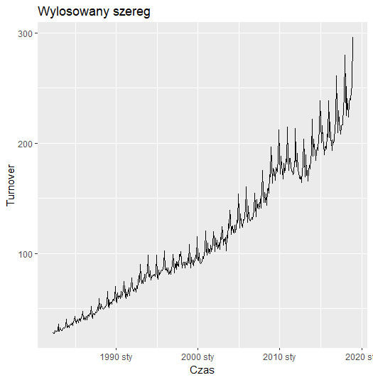

### Wykres sezonowy
```r
myseries |>
  gg_season(Turnover) +
  labs(
    title = "Sezonowość szeregu aus_retail",
    x = "Kwartał / miesiąc",
    y = "Turnover"
  )
```
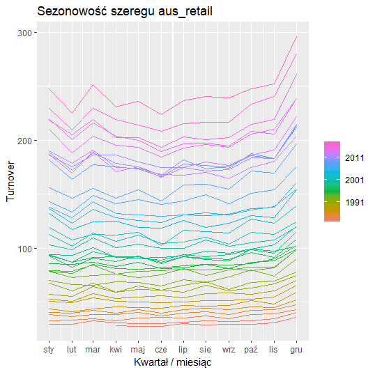

#### Interpretacja wykresu sezonowego:

Z wykresu sezonowego widzimy, że obroty sprzedaży w Australii mają wyraźną sezonowość:
* **Wyższe obroty w okresie świątecznym:** Największe piki sprzedażowe przypadają na **grudzień**.
* **Stabilne wzrosty:** Zauważalne systematyczne zwiększenie obrotów w miesiącach **marzec-czerwiec**.
* **Sezonowość letnia:** Okresy letnie charakteryzują się wyraźnie niższymi obrotami w porównaniu do miesięcy zimowych.

### Wykres subseries

```r
myseries |>
  gg_subseries(Turnover) +
  labs(
    title = "Wykres subseries dla aus_retail",
    x = "Okres sezonowy",
    y = "Turnover"
  )
```
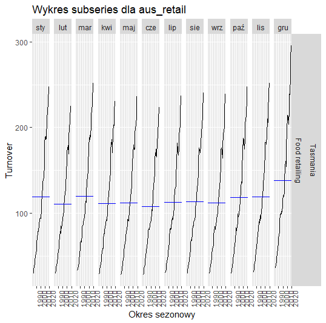

#### Interpretacja wykresu subseries:

Analiza wykresu podserii pozwala na wyciągnięcie następujących wniosków:
* **Zmiany w czasie:** Wykres pokazuje, jak obroty sprzedaży zmieniały się w każdym miesiącu na przestrzeni różnych lat.
* **Sezonowość:** Widać wyraźną sezonowość (regularne zmiany co roku) z najwyższymi obrotami w **grudniu**. Sugeruje to silny wpływ okresu świątecznego na wzrost sprzedaży detalicznej.
* **Cykliczność:** Regularny wzrost obrotów w różnych miesiącach (widoczny poprzez wznoszące się linie średnich) wskazuje na cykliczność oraz długoterminową powtarzalność wzorca wzrostowego.

### Wykres opóźnień (Lag plot)

```r
myseries |>
  gg_lag(Turnover, geom = "point") +
  labs(title = "Lag plot dla aus_retail")
```
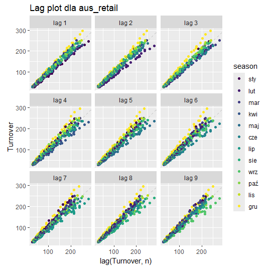

#### Interpretacja wykresu opóźnień:

* **Wpływ przeszłości:** Wykres opóźnień obrazuje relację między historycznymi wartościami obrotów (`Turnover`) a ich obecnymi odczytami.
* **Charakter korelacji:** Punkty na wykresie układają się w wyraźną, rosnącą linię, co świadczy o **silnej korelacji dodatniej** między przeszłymi a obecnymi wartościami. 
* **Wniosek:** Taka struktura danych potwierdza, że obecne obroty są ściśle uzależnione od wyników z poprzednich miesięcy, co jest typowe dla szeregów z silnym trendem.

### 1.3 Analiza autokorelacji (ACF)
---

```r
myseries |>
  ACF(Turnover) |>
  autoplot() +
  labs(title = "ACF dla wylosowanego szeregu")
```
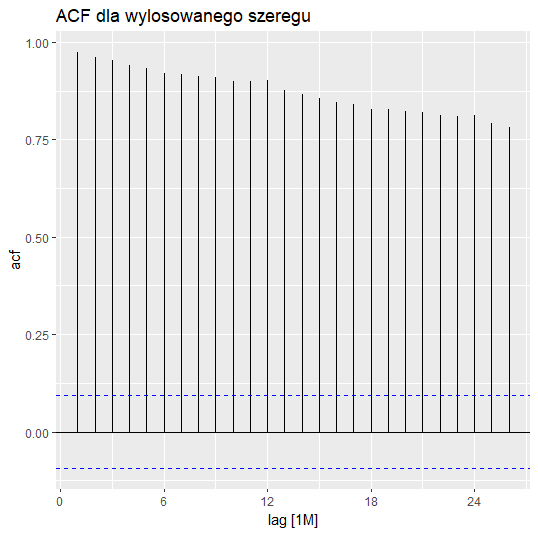

#### Wnioski z wykresu ACF:

#### Kluczowe wnioski z ACF:
* **Silny trend:** Bardzo wysokie słupki, które powoli opadają, potwierdzają wyraźny trend wzrostowy.
* **Stabilność:** Szereg nie jest stabilny w czasie 
* **Sezonowość:** Kształt wykresu potwierdza występowanie cyklicznych, rocznych wzorców sprzedaży.

### 1.4 Dekompozycja STL
---

```r
fit_stl_retail <- myseries |>
  model(
    STL = STL(Turnover ~ trend(window = 13) + season(window = "periodic"), robust = TRUE)
  )

components(fit_stl_retail) |>
  autoplot() +
  labs(title = "Dekompozycja STL - aus_retail")
```
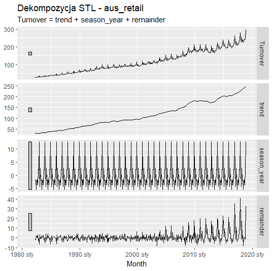

#### Wnioski z dekompozycji STL:

* **Trend:** Obroty w sprzedaży detalicznej wykazują stałą tendencję wzrostową w czasie.
* **Sezonowość:** Występują wyraźne zmiany cykliczne w ciągu roku, z charakterystycznymi szczytami sprzedaży w **grudniu**.
* **Reszty:** Istnieje zauważalna zmienność, której nie wyjaśnia trend ani sezonowość.

### 1.5 Wizualna ocena stabilności wariancji
---

```r
myseries |>
  autoplot(Turnover) +
  labs(title = "Ocena stabilności wariancji - skala oryginalna")

myseries |>
  autoplot(log(Turnover)) +
  labs(title = "Ocena stabilności wariancji - skala logarytmiczna")
```
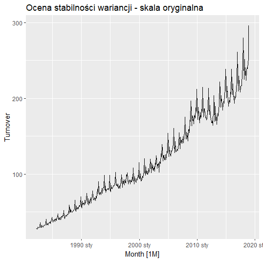

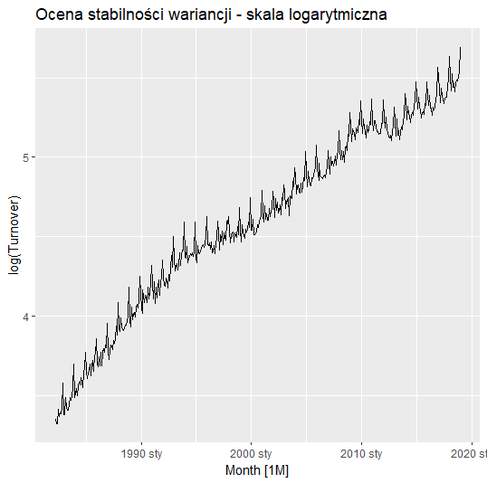

#### Ocena stabilności wariancji:

* **Wariancja na skali oryginalnej:** Wyraźnie widać, że wariancja rośnie wraz z upływem czasu. Im wyższa wartość obrotów (*Turnover*), tym większe stają się wahania w danych. 

* **Po transformacji logarytmicznej:** Na wykresie wykorzystującym skalę logarytmiczną wariancja jest znacznie **bardziej stabilna**. 

### 1.6 Transformacja Box-Cox
---
Aby precyzyjnie dobrać transformację stabilizującą wariancję, stosujemy metodę Guerrero, która pozwala wyznaczyć optymalny parametr $\lambda$ (lambda).

Obliczony parametr wynosi $\lambda = 0.0902$.

```r
# Dobór parametru Box-Cox metodą Guerrero
lambda_info <- myseries |>
  features(Turnover, features = guerrero)

lambda <- lambda_info$lambda_guerrero[1]
lambda

# Generowanie wykresu po transformacji
myseries |>
  mutate(Turnover_boxcox = box_cox(Turnover, lambda)) |>
  autoplot(Turnover_boxcox) +
  labs(
    title = paste("Szereg po transformacji Box-Cox, lambda =", round(lambda, 3)),
    x = "Czas",
    y = "Przetransformowany Turnover"
  )
```

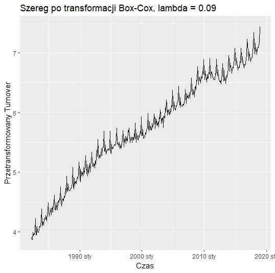

#### Wnioski z zastosowania transformacji:

* **Podobieństwo do logarytmu:** Wykres po transformacji Box-Cox przy wartości $\lambda = 0.09$ jest bardzo zbliżony do wykresu po transformacji logarytmicznej. Wynika to z faktu, że parametr $\lambda$ jest bliski $0$.
* **Efekt stabilizacji:** Zastosowana transformacja jest w tym przypadku odpowiednia, ponieważ skutecznie stabilizuje wariancję.

## 2. Budowa modeli bazowych i ocena prognoz

W tej sekcji dzielimy dane na zbiór uczący i testowy, sprawdzamy stacjonarność oraz porównujemy proste metody prognozowania.

### 2.1 Podział na zbiór uczący i testowy
---
Dane zostały podzielone na: 
* **Zbiór uczący:** dane sprzed 2011 roku.
* **Zbiór testowy:** dane od 2011 roku.

```r
train <- myseries |>
  filter(Month < yearmonth("2011 Jan"))

test <- myseries |>
  filter(Month >= yearmonth("2011 Jan"))
```
### 2.2 Testy stacjonarności
---
Aby sprawdzić, czy szereg wymaga różnicowania, przeprowadzono dwa testy statystyczne:
1. **Test ADF:** p-value > 0.05, więc nie ma podstaw do odrzucenia H0. Szereg jest NIESTACJONARNY
2. **Test KPSS:** p-value < 0.05, co potwierdza, że szereg jest **niestacjonarny**.

```r
adf_result <- adf.test(train$Turnover)
adf_result

train |>
  features(Turnover, unitroot_kpss)
```

### 2.3 Porównanie modeli prognozujących
---
Przetestowano trzy podejścia:
1. **Naiwna Sezonowa (SNAIVE):** model bazowy kopiujący ostatni wzorzec sezonowy.
2. **Box-Cox + SNAIVE:** model SNAIVE z zastosowaną transformacją stabilizującą wariancję.
3. **Dekompozycja STL:** prognozowanie danych odsezonowanych.

```r
# Budowa modeli porównawczych
fit <- train |>
  model(
    `Naiwna Sezonowa` = SNAIVE(Turnover),
    `Box-Cox + SNAIVE` = SNAIVE(box_cox(Turnover, lambda)), 
    `Dekompozycja STL` = decomposition_model(
      STL(Turnover ~ trend(window = 13) + season(window = "periodic"), robust = TRUE),
      SNAIVE(season_adjust) 
    )
  )

# Generowanie prognoz na okres testowy
fc <- fit |> forecast(test)

# Wykres porównawczy
fc |>
  autoplot(myseries, level = NULL) +
  labs(title = "Porównanie metod prognozowania",
       y = "Turnover", x = "Czas")
```
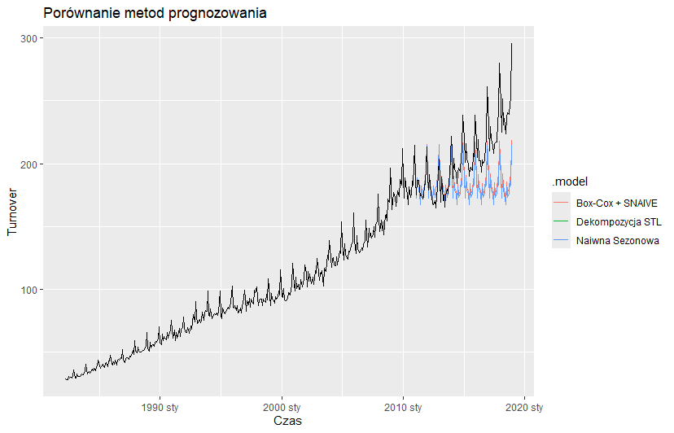

#### Wnioski z wizualizacji:
* Wszystkie modele poprawnie zidentyfikowały sezonowość.
* Dane rzeczywiste oznaczone czarną linią rosną znacznie szybciej niż prognozy. Sama stabilizacja wariancji nie wystarczyła, by przewidzieć nagły skok obrotów po 2015 roku.

### 2.4 Ocena jakości
---
```r
fc_accuracy <- accuracy(fc, myseries)
fc_accuracy |>
  select(.model, RMSE, MAE, MAPE, MASE) |>
  arrange(RMSE)
```
Poniższa tabela przedstawia błędy prognoz na zbiorze testowym:

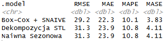

**Kluczowe obserwacje:**
1. Najlepszym modelem okazał się **Box-Cox + SNAIVE** (najniższe wartości RMSE, MAE, MAPE).
2. Transformacja Box-Cox poprawiła wynik (spadek błędu MAPE z 10.8% do 10.1%).
3. Model Dekompozycja STL uzyskał identyczne wyniki jak Naiwna Sezonowa. W tym przypadku dekompozycja nie wniosła dodatkowej poprawy prognozy.
4. Wartość **MASE > 1** dla wszystkich modeli wskazuje, że radzą sobie one gorzej na zbiorze testowym niż prosta metoda naiwna na zbiorze uczącym (wynika to ze zmiany trendu).

### 2.5 Analiza reszt modelu Box-Cox + SNAIVE
---
Wybrano najlepszy model do szczegółowej analizy błędów.

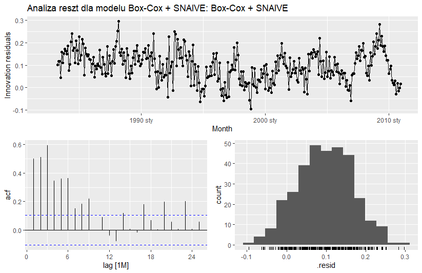

#### Interpretacja analizy reszt:
* **Wykres czasowy:** Reszty znajdują się głównie w wartościach dodatnich, wiec prognoza jest niedoszacowana.
Rzeczywista sprzedaż rosła szybciej, niż przewidział to model.
* **Wykres ACF:** Reszty **nie są białym szumem** – w danych wciąż są wzorce.
* **Histogram:** Rozkład błędów jest przesunięty w prawo (średnia > 0). Prognozy są zbyt niskie względem rzeczywistości.

**Wniosek:** Mimo że Box-Cox + SNAIVE był najlepszy w tej grupie, analiza reszt pokazuje, że potrzebujemy bardziej zaawansowanych modeli (jak ARIMA lub ETS), które lepiej radzą sobie z autokorelacją reszt.

## 3. Modele ETS 

W tej sekcji testujemy zaawansowane modele wykładnicze, które potrafią lepiej dostosować się do trendu i zmieniającej się amplitudy sezonowości.

### 3.1 Dopasowanie modeli Holta-Wintersa
---
Do analizy wybrano trzy warianty modeli:
1. **HW Multiplikatywny:** Uwzględnia fakt, że wahania sezonowe rosną wraz z trendem.
2. **HW Tłumiony:** Zakłada, że trend może wyhamować w przyszłości.
3. **Model STL+ETS:** Połączenie dekompozycji z modelem ETS na danych odsezonowanych.

```r
fit_ets <- train |>
  model(
    `HW Multiplikatywny` = ETS(Turnover ~ error("M") + trend("A") + season("M")),
    `HW Tłumiony` = ETS(Turnover ~ error("M") + trend("Ad") + season("M")),
    `Model STL+ETS` = decomposition_model(
      STL(box_cox(Turnover, lambda) ~ trend(window = 13) + season(window = "periodic")),
      ETS(season_adjust ~ error("A") + trend("A") + season("N"))
    )
  )
```
### 3.2 Porównanie dokładności
---
```r
fc_ets <- fit_ets |> forecast(test)

fc_ets_accuracy <- fc_ets |> 
  accuracy(myseries) |>
  select(.model, RMSE, MAE, MAPE, MASE) |>
  arrange(RMSE)

fc_ets_accuracy
```
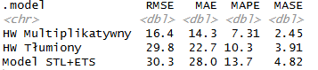

**Wnioski:**
* Model **Holta-Wintersa Multiplikatywny** okazał się najlepszym modelem.
* RMSE spadło niemal o połowę (z 29.2 do 16.4), a błąd MAPE obniżył się do poziomu **7.3%**.
* Model STL+ETS okazał się najgorszy.

### 3.3 Analiza reszt najlepszego modelu
---
```r
best_ets_name <- fc_ets_accuracy$.model[which.min(fc_ets_accuracy$RMSE)]

fit_ets |>
  select(all_of(best_ets_name)) |>
  gg_tsresiduals() +
  labs(title = paste("Analiza reszt dla modelu HW Multiplikatywnego:", best_ets_name))
```

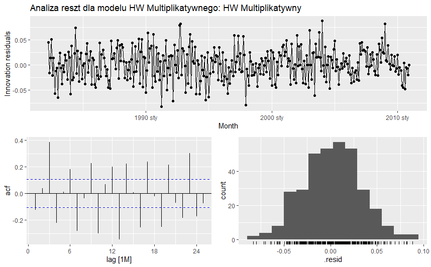

**Interpretacja:**
1. **Wykres czasowy:** W przeciwieństwie do modelu SNAIVE, tutaj reszty oscylują wokół zera. Model przestał systematycznie niedoszacowywać prognozy.
2. **ACF reszt:** Słupki w ACF są znacznie niższe niż wcześniej, więc model ETS znacznie lepiej sobie radzi. Nadal występują sezonowe przekroczenia (np. luty, grudzień), ale błąd jest dużo mniejszy.
3. **Histogram:** Rozkład błędów jest symetryczny i przypomina rozkład normalny. Reszty są bliższe białemu szumowi niż w poprzednich testach.

### 3.4 Wykres prognozy ETS
---

```r
fc_ets |>
  filter(.model == best_ets_name) |>
  autoplot(myseries, level = NULL) +
  labs(
    title = paste("Najlepsza prognoza metodą ETS:", best_ets_name),
    subtitle = "Porównanie z rzeczywistymi danymi po 2011 roku",
    x = "Czas", y = "Turnover"
  )
```
Poniższy wykres prezentuje dopasowanie modelu HW Multiplikatywnego do danych rzeczywistych na zbiorze testowym (po 2011 roku).

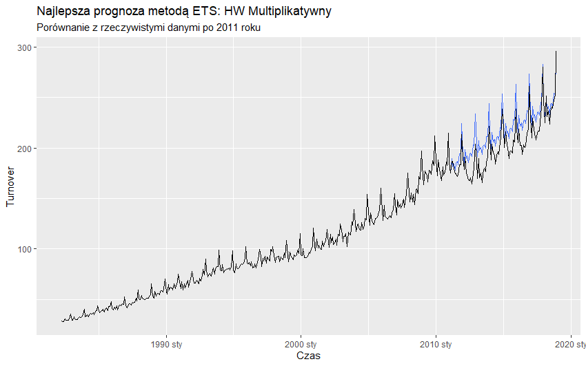

**Wnioski:**
Prognoza niemal idealnie pokrywa się z danymi rzeczywistymi. Model dobrze przewidział, że im wyższa sprzedaż, tym wyższe skoki w grudniu.

## 4. Modele ARIMA

### 4.1 Automatyczny dobór modelu ARIMA
---
Zastosowano funkcję automatycznego doboru parametrów, która wybrała model: **ARIMA(2,1,2)(0,1,2)[12]**.

```r
fit_arima <- train |>
  model(
    `ARIMA automatyczna` = ARIMA(Turnover)
  )

fit_arima |> report()
```
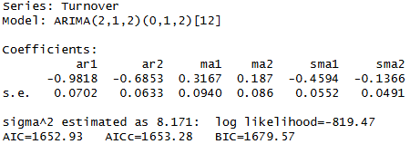

**Interpretacja wyników:**
* **Różnicowanie (d=1, D=1)** Model automatycznie zastosował różnicowanie zwykłe i sezonowe. Dzięki temu dane stały się stacjonarne.
* **Struktura:** Model jest bardzo złożony. Wykorzystuje 2 parametry AR (autokorelacja) i 2 parametry MA (średnia ruchoma) zarówno dla części zwykłej, jak i sezonowej.
* **Wariancja błędu:** Wartość $\sigma^2 = 8.171$ sugeruje niską wariancję błędu.

### 4.2 Analiza parametrów i stacjonarności
---

```r
fit_arima |> 
  tidy() |> 
  select(.model, term) |> 
  distinct()
```
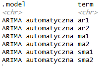

**Interpretacja:**
1. **AR1, AR2 (Autoregresja):** Model uwzględnia korelacje z dwoma poprzednimi miesiącami.
2. **MA1, MA2 (Średnia ruchoma):** Model koryguje prognozę na podstawie błędów z dwóch poprzednich okresów.
3. **SMA1, SMA2 (Sezonowa średnia ruchoma):** Model koryguje bieżącą prognozę sezonową, patrząc na błędy prognoz z tych samych miesięcy w poprzednich latach.

Tabela potwierdza, że model jest sezonowy.

```r
# Wizualna analiza reszt:
fit_arima |> 
  select(`ARIMA automatyczna`) |> 
  gg_tsresiduals() +
  labs(title = "Analiza reszt modelu ARIMA - weryfikacja stacjonarności")
```
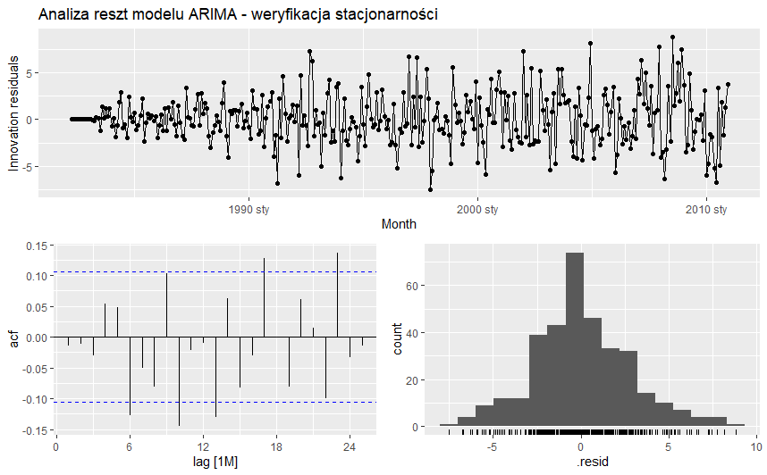

**Wnioski:**
* **Stacjonarność:** Reszty oscylują wokół zera, co potwierdza stacjonarność. Widać jednak, że rozrzut rośnie.
* **Autokorelacja:** ARIMA pozbyła się korelacji znacznie lepiej niż modele naiwne. Reszty są bardzo bliskie białemu szumowi.
* **Rozkład błędów:** Histogram przypomina rozkład normalny i jest wycentrowany na zerze. Oznacza to, że model nie jest obciążony (nie myli się systematycznie w żadną stronę).

### 4.3 Porównanie modeli: ARIMA vs ETS (Holt-Winters)
---

```r
fc_arima <- fit_arima |> forecast(test)

accuracy_comparison <- bind_rows(
  fc_ets |> accuracy(myseries), 
  fc_arima |> accuracy(myseries)
) |> 
  select(.model, RMSE, MAE, MAPE, MASE) |> 
  arrange(RMSE)

accuracy_comparison
```
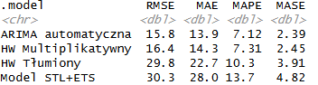

**Interpretacja:** Model **ARIMA** okazał się być najlepszym modelem. Najlepiej radzi sobie z wyłapywaniem trendu i sezonowości.
* **RMSE (15.8):** Najmniejsze odchylenie od wartości rzeczywistych.
* **MAPE (7.12%):** Najwyższa precyzja procentowa.
